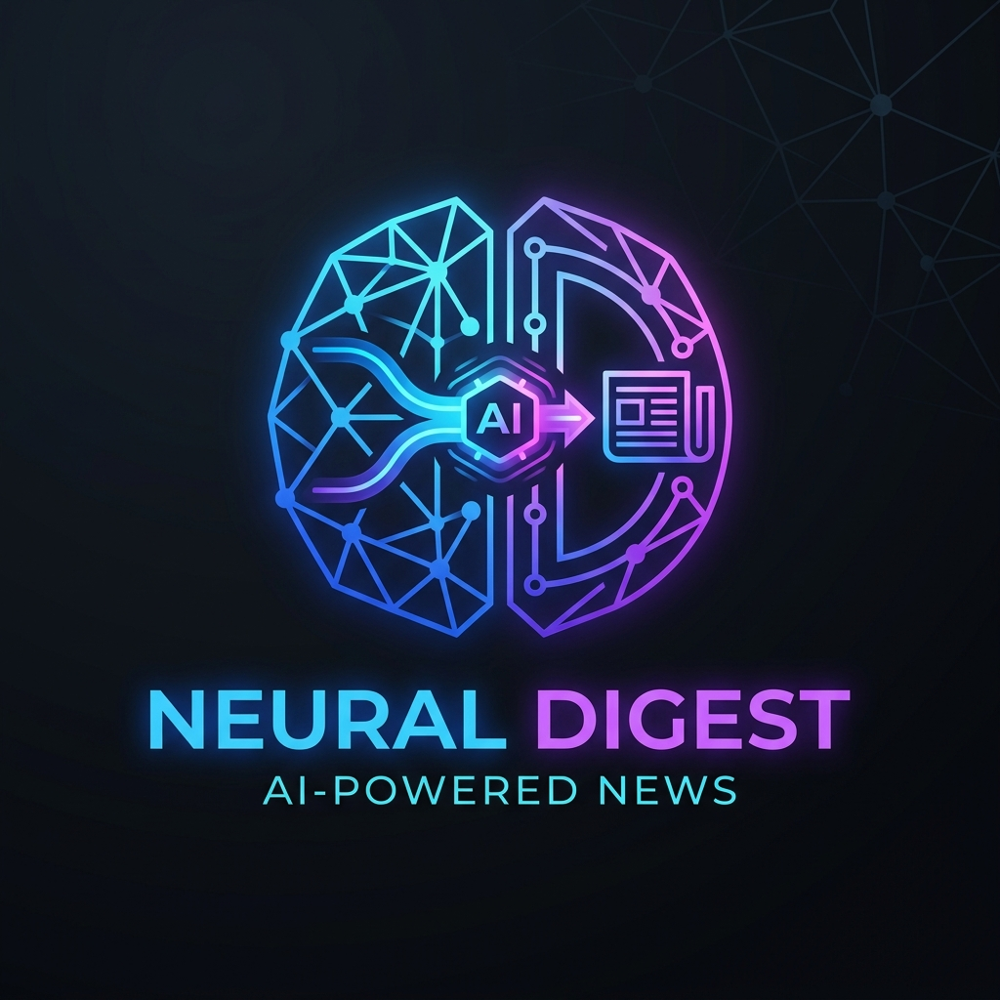

<div align="center">
  
  <h1>Personal Intelligence Digest</h1>
  <p><em>A sleek, automated, AI-powered weekly intelligence digest for software engineers.</em></p>
</div>

---

Bypass the noise of social media. This automated pipeline scrapes high-trust sources directly, uses Gemini AI to summarize the top news into actionable insights, and delivers a scannable, premium HTML email straight to your inbox.

📖 **Want to know how it works under the hood? Check out [ABOUT.md](ABOUT.md) for the full architecture and logic breakdown.**

## ✨ Features
- **High-Trust Sources:** Direct ingestion from CISA, GitHub releases, BleepingComputer, and more.
- **AI-Powered Summaries:** Gemini AI extracts exactly *why it matters* and the *action to take*.
- **Smart Ranking:** Items are ranked by trust score, recency, and keyword value (e.g., CVEs and free deals score highest).
- **Automated Delivery:** Runs on a Monday cron job via GitHub Actions.

## 🚀 Quick Start

### 1. Clone & Install
```powershell
git clone https://github.com/ff7hpp/Ai-News.git
cd Ai-News
py -3.11 -m venv .venv
.\.venv\Scripts\Activate.ps1
pip install -r requirements.txt
```

### 2. Configure Environment
Copy `.env.example` to `.env` and fill in your details:
```env
GEMINI_API_KEY=your_gemini_api_key
SMTP_HOST=smtp.gmail.com
SMTP_PORT=587
SMTP_USERNAME=your_email@gmail.com
SMTP_PASSWORD=your_app_password
EMAIL_FROM=your_email@gmail.com
EMAIL_TO=recipient_email@gmail.com
```

### 3. Run It!
**Test Run (No Email):**
```powershell
python -m app.main --no-send
```

**Full Run (Send Email):**
```powershell
python -m app.main
```
