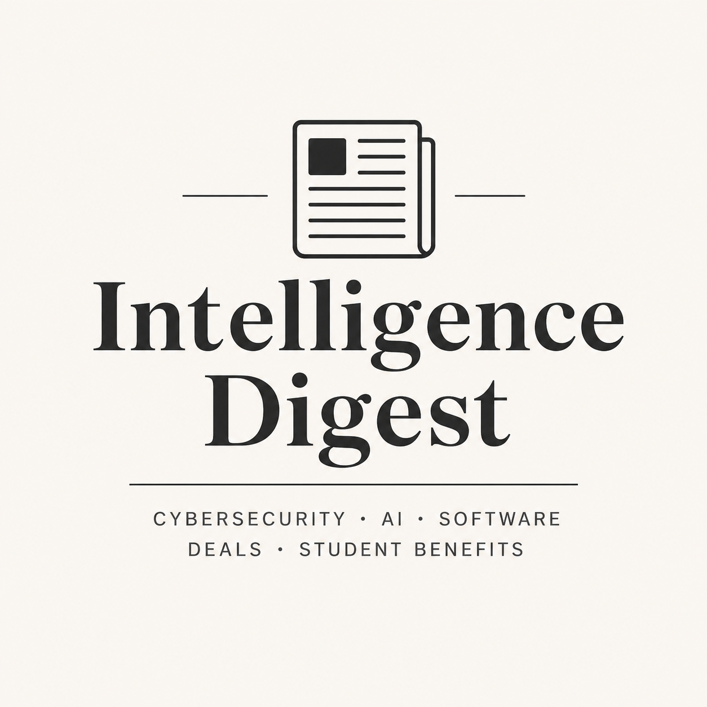

<div align="center">
  

  # Intelligence Digest

  **A personal AI-powered weekly news digest built to reduce scrolling and filter useful updates.**

  Cybersecurity • AI • Software • Deals • Student Benefits
</div>

---

## Why I Built This

I built **Intelligence Digest** because I was spending too much time scrolling through different websites, feeds, and social media just to find the specific news I actually care about.

As a software engineering student interested in cybersecurity, AI, software tools, useful deals, and student benefits, I wanted a simple system that collects the important updates for me automatically.

The goal is simple:

> Spend less time searching and scrolling. Get the useful information directly.

---

## What This Project Does

**Intelligence Digest** collects news from trusted sources, ranks the most relevant items, summarizes them using AI, and sends the final result as a clean weekly HTML email.

Instead of checking many platforms manually, this project creates one organized weekly briefing.

---

## Features

- **Trusted Sources:** Collects updates from sources like CISA, GitHub releases, BleepingComputer, and other reliable feeds.
- **AI Summaries:** Uses Gemini AI to explain why each item matters and what action should be taken.
- **Smart Ranking:** Ranks news based on trust score, recency, keywords, and importance.
- **Weekly Email Digest:** Sends a clean and readable HTML email.
- **Automation:** Runs automatically using GitHub Actions.

---

## How It Works

1. Collects news from RSS feeds, GitHub releases, Google News, and selected websites.
2. Cleans and removes duplicate items.
3. Scores each item based on relevance and importance.
4. Uses Gemini AI to summarize the top results.
5. Generates a clean HTML digest.
6. Sends the digest by email every week.

---

## Tech Stack

- Python
- SQLite
- Gemini AI
- BeautifulSoup
- RSS / Atom feeds
- SMTP Email
- GitHub Actions
- YAML configuration files

---

## Quick Start

### 1. Clone the Repository

```powershell
git clone https://github.com/ff7hpp/Ai-News.git
cd Ai-News
```

### 2. Create a Virtual Environment

```powershell
py -3.11 -m venv .venv
.\.venv\Scripts\Activate.ps1
pip install -r requirements.txt
```

### 3. Configure Environment Variables

Create a `.env` file and add your details:

```env
GEMINI_API_KEY=your_gemini_api_key
SMTP_HOST=smtp.gmail.com
SMTP_PORT=587
SMTP_USERNAME=your_email@gmail.com
SMTP_PASSWORD=your_app_password
EMAIL_FROM=your_email@gmail.com
EMAIL_TO=recipient_email@gmail.com
```

### 4. Run the Project

Test run without sending email:

```powershell
python -m app.main --no-send
```

Run and send the digest:

```powershell
python -m app.main
```

---

## Project Goal

This project is my personal solution for information overload.

I created it to help me stay updated without wasting time scrolling, searching, and filtering through irrelevant content. It gives me the news I care about in a simple, organized, and automated way.
